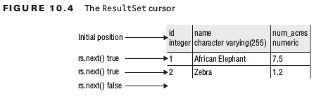

# OCP Chapter 10 - JDBC
**JDBC**: Java Database Connectivity<br>
**ORM**: Object Relational Mapping


### 4 Main interfaces in JDBC
1. Driver     - knows how to get a connection to the database
2. Connection - knows how to communicate with the database
3. Statement  - knows how to run sql
4. ResultSet  - knows what was returned by a SELECT query


Vendors (e.g. mysql, oracle) will implement these interfaces. They become available as a jar. When executing a
program this jar needs to be on the classpath)

- Driver implementations are required to be placed in **META-INF/service** directory since JDBC 4.0.
- Class.forName() was used by old drivers to the load the driver (prior to 4.0)

####JDBC url format

jdbc:postgres://localhost:5300/zoo

*_protocol_:_vendor_:_database-specific-connection-details_*

#### Connection
Two ways to get a connection to the database:
1. DatabaseManager (this course)
2. DataSource (what we use in industry)

#### Statement
Two ways to get a statement:
1. Statement stmt = connection.createStatement()
2. Statement stmt = connection.createStatment(resultSetType, concurrencyMode)

#### ResultSet Types
| <big>ResultSet Type</big> | <big>Notes</big>                    |
| ------------------------- | :---------------------------------- |
| TYPE_FORWARD_ONLY         | default. Can go through data in the order in which it is retrieved|
| TYPE_SCROLL_SENSITIVE     | Allow going through data in any order. Result set changes when changes made to the db|
| TYPE_SCROLL_INSENSITIVE   | Allow going through data in any order. Result set doesn't change when db changes|

#### ResultSet Concurrency Modes
| <big>ResultSet Concurrency mode</big> | <big>Notes</big>                    |
| ------------------------- | :---------------------------------- |
| CONCUR_READ_ONLY          | default. Cannot modify the db using the ResultSet|
| CONCUR_UPDATEABLE         | allows modification of db via ResultSet|

If you try to create a statement with an unsupported mode, JDBC driver will downgrade the request to one that is supported.

### Executing Statements
Statements can execute SQL by one of the following:
1. executeUpdate()
2. executeQuery()
3. execute()

#### Types of SQL runnable by each type of execute()
 </img>

#### Return types for each type of execute()
 </img>

### Reading a ResultSet
- ResultSet has a _cursor_ which points to the current location in the data
- The cursor starts pointing to the location before the ResultSet and then moves to the next rows of data
- Always check whether rs.next() has a value before trying to retrieve anything
```java
Map<Integer, String> idToNameMap = new HashMap<>();
ResultSet rs = stmt.executeQuery("select id, name from species");
while(rs.next()) {
    int id = rs.getInt("id");
    String name = rs.getString("name");
    idToNameMap.put(id, name);
}
System.out.println(idToNameMap); // {1=African Elephant, 2=Zebra}
```

#### The ResultSet cursor
 </img>

- Can also access the columns by *index* instead of a column name
- Columns are counted starting with 1 instead of 0

```java
Map<Integer, String> idToNameMap = new HashMap<>();
ResultSet rs = stmt. executeQuery ("select id, name from species");
while(rs.next()) {
    int id = rs.getInt(1);
    String name = rs.getString(2);
    idToNameMap.put(id, name);
}

ResultSet rs = stmt.executeQuery("select count(*) from animal");
rs.getInt(1); // throws SQLException
// Result set cursor is still pointing to a location before the first row

ResultSet rs = stmt.executeQuery("select id from animal");
rs.next();
rs.getInt("badColumn"); // throws SQLException
// Trying to get a column that isn't in the resultSet throws a SQLException
```
#### ResultSet get methods
 </img>

#### JDBC date and time types
 </img>

#### Scrolling ResulSet
- Every method apart from next() requires a SCROLLABLE ResultSet
- Remember, can't use previous if the connection was made with TYPE_FORWARD only
- JDBC automatically closes ResultSet when you run another SQL from the same Statement object
##### First and last
 </img>

##### Absolute and Negative
 </img>

 </img>

```java
Statement stmt = conn.createStatement(
    ResultSet.TYPE_SCROLL_INSENSITIVE,
    ResultSet.CONCUR_READ_ONLY);

ResultSet rs = stmt.executeQuery("select id from animal order by id");
System.out.println(rs.absolute(2));     // true
System.out.println(rs.getString("id")); // 2
System.out.println(rs.absolute(0));     // false
System.out.println(rs.absolute(5));     // true
System.out.println(rs.getString("id")); // 5
System.out.println(rs.absolute(-2));    // true
System.out.println(rs.getString("id")); // 4
```

##### Navigating a ResultSet
 </img>

#### Dealing with Exceptions
**SQLExceptions**
- e.getMessage() - human readable
- e.getSQLState() - returns a code as to what went wrong
- e.getErrorCode() - returns database specific code
