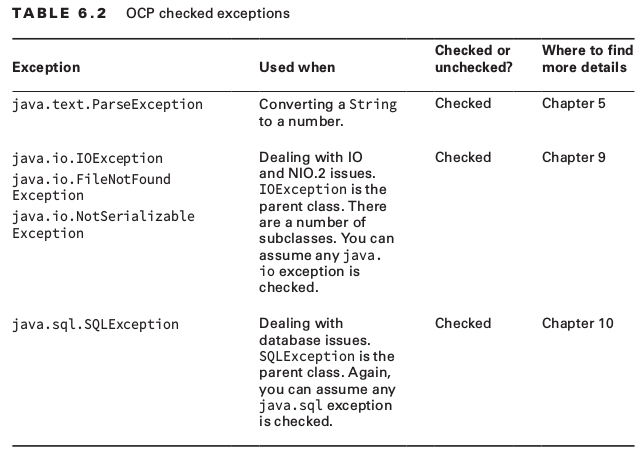
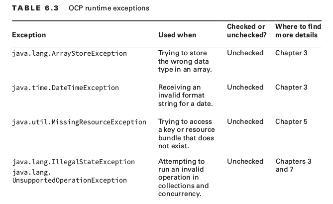

# OCP Chapter 6 - Exceptions and Assertions

 </img>

#### Checked Exceptions
 </img>

#### Runtime Exceptions
 </img>

#### Traditional try statement
- Uses braces "{}"
- Needs presence of either catch / finally

#### Try with resources
- Uses parenthesis "()"
- Can only be used with classes that implement the *'Closeable'* or *'Autocloseable'* interface
- Resources that are defined within parenthesis are automatically closed in the reverse order that they are declared
- Does not require any catch or finally blocks
- Each statement is separated by semi colons ";"

#### Closeable v.s AutoCloseable

| <big>Closeable</big>                   | <big>AutoCloseable</big>                    |
| -------------                          | :-----------:                               |
| ```void close() throws IOException```  | ```void close() throws Exception```         |
| throws **IOException**                 | throws **Exception**                        |
| prior to Java 7                        | since Java 7                                |

#### Suppressed Exceptions
When there are multiple exceptions thrown whilst using try with resources:
- First exception thrown becomes the *primary* exception
- Subsequent exceptions (e.g. thrown via close() methods) get added to *suppressed* exceptions. *N.B the catch statement will only be used for primary exceptions*

##### What happens when the close() method throws an exception? E.g:
```java
    public class JammedTurkeyCage implements AutoCloseable {
        public void close() throws IllegalStateException {
            throw new IllegalStateException("Cage door does not close");
        }
        public static void main(String[] args) {
            try (JammedTurkeyCage t = new JammedTurkeyCage()) {
                System.out.println("put turkeys in");
            } catch (IllegalStateException e) {
                System.out.println("caught: " + e.getMessage());
            }
        }
    }
```
- Exception thrown by close() becomes the primary exception. prints out:
``` 
"put turkeys in"
"caught: Cage door does not close"
```

##### When try clause ALSO throws an exception, E.g.:
```java
    try (JammedTurkeyCage t = new JammedTurkeyCage()) {
        throw new IllegalStateException("turkeys ran off");
    } catch (IllegalStateException e) {
        System.out.println("caught: " + e.getMessage());
        for (Throwable t: e.getSuppressed())
        System.out.println(t.getMessage());
    }
```
- The exception from close() gets added to *suppressed* exceptions, prints out:
```
    caught: turkeys ran off
    Cage door does not close
```

##### Remember, catch statements are only for the PRIMARY exception:
```java
try (JammedTurkeyCage t = new JammedTurkeyCage()) {
	throw new RuntimeException("turkeys ran off");
} catch (IllegalStateException e) {
	System.out.println("caught: " + e.getMessage());
}
```
- The PRIMARY exception is a RuntimeException. close() throws an IllegalStateException but this is unable to be caught in the catch statement because the catch is only for PRIMARY exceptions. We end up with a stack trace, RuntimeException with a suppressed IllegalStateException.

##### Suppressed exceptions only apply to exceptions thrown in the try clause.
```java
    try (JammedTurkeyCage t = new JammedTurkeyCage()) {
        throw new IllegalStateException("turkeys ran off");
    } finally {
        throw new RuntimeException("and we couldn't find them");
    }
```
- Primary exception of "turkeys ran off" with a suppressed exception of "Cage door does not close". Then the finally block runs. This throws a new exception and this wipes out evidence of the previous exception. We are left with a single RuntimeException. It is bad programming practice.

#### Catch statements
- When catching multiple exceptions, cannot catch broader exception first. E.g. cannot catch Exception first followed by RuntimeException
- Can catch multiple exceptions on a single line in this format:
```java
    try {
      // Some code
    } catch (RuntimeException | FileNotFoundException | ParseException e) {

    }
```
- In a single catch statement
    * Exception e is ONLY allowed to be reassigned to exception of same type or subclass
- In a multi catch statement
    * Exceptions cannot be subclasses of one another
    * Not allowed to re-assign an exception
    ```java
        catch(RuntimeException | ParseException e) {
            e = new AnyException() // Won't compile!
        }
    ```

#### Re-throwing Exceptions
Suppose the following code:
```java
public void parseData() throws SQLException, DateTimeParseException {}

public void multiCatch() throws SQLException, DateTimeParseException {
	try {
		parseData();
	} catch (SQLException | DateTimeParseException e) {
		System.err.println(e);
		throw e;
	} 
}
```
Can be re-written as:
```java
public void reThrowing() throws SQLException, DateTimeParseException {
	try {
		parseData();
	} catch (Exception e) { // Java can interpret this exception as possible exceptions
		System.err.println(e);
		throw e;
	} 
}
```
- Java interprets Exception as the possible exceptions that can be thrown in the method

#### Assertions

Typically only use assertions for testing and debugging, usually turned off for production

Have to be enabled explicitly when running your java application:
```java
java -ea ClassNameToRun
java -enableassertions ClassNameToRun
java -ea:<package-name>
java -ea:<package-name>... (... means any class is specified package or subclass)

java -da ClassNameToRun
java -disableassertions ClassNameToRun

// (enables all assertions except for on class)
java -ea:com.willey.demos... -da:com.wiley.demos.TestColors my.programs.Main

```

#### Assertion Syntax
```java
assert boolean_expression;
assert boolean_expression: error_message;
```

It's bad practice to modify outcomes in an assertion, e.g.
```java
// Naughty!, not a good design
assert ++x > 10;
```