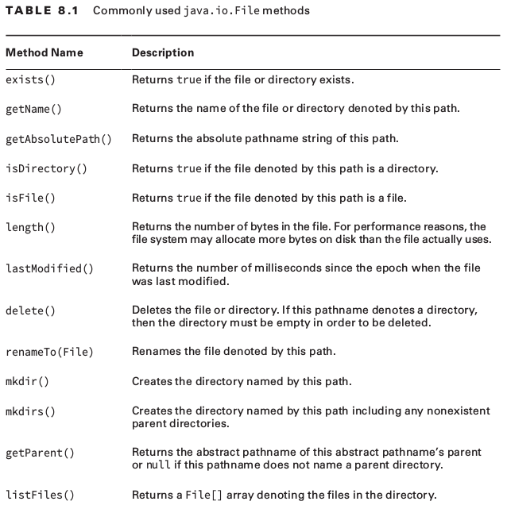
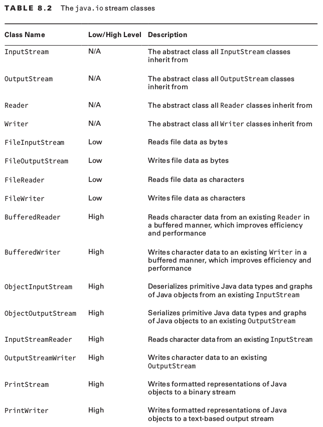
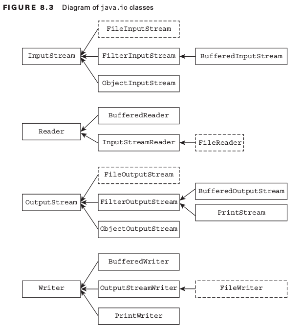

# OCP Chapter 8 - IO

#### Commonly used java.io.File methods
 </img>

#### Byte Streams v.s Character Streams
*java.io* defines two sets of classes for reading and writing streams. Those with **Stream** in their name and those with **Reader/Writer** in their name.

##### Differences between Streams and Readers/Writers
1. Stream classes are used for inputting/outputting all types of **binary / byte** data.
2. Reader and Writer classes are used for inputting/outputting only character and String data.

##### Why use Character Streams?
- Convenient when working with text data

##### Low-Level v.s High-Level Streams
**Low-Level**:
    - Connects directly with source of data, e.g. file / array / String
    - Process raw data / resource and are accessed in a direct and unfiltered manner.
    
**High-Level**:
    - Built on top of another stream using wrapping.
    -

#### The java.io stream classes
 </img>

#### Common Stream Operations
1. Closing streams
    - Closed with a call to close() or 
    - Using the the try-with-resources syntax
2. Flushing the stream
    - call the flush() method to ensure all accumulated data is written immediately
3. Marking the stream
    - before calling these methods, call **markSupported()** first (Otherwise you'll get a runtime exception)
    - mark(int) : Read as many bytes as wanted up to read-ahead limit value.
    - reset() : move the stream back to an earlier position, last place mark() was called
    ```java
    InputStream is = ... "ABCD"
    System.out.print ((char)is.read());
    if(is.markSupported()) {
        is.mark(100);
        System.out.print((char)is.read());
        System.out.print((char)is.read());
        is.reset();
    }
    System.out.print((char)is.read());
    System.out.print((char)is.read());
    System.out.print((char)is.read());
    // Prints ABCBCD
    ```
4. Skipping over data
    - skip(long): skips over a certain number of bytes. Returns the number of bytes that were actually skipped.
    ```java
    InputStream is = ... "TIGERS"
    System.out.print ((char)is.read());
    is.skip(2)
    is.read();
    System.out.print((char)is.read());
    System.out.print((char)is.read());
    // Prints TRS
    ```

#### Diagram of java.io classes
 </img>

## Working With Streams

#### 1. FileInputStream and FileOutputStream
- Used to read / write bytes to a file
- Uses constructor that takes a File object or String, representing path to a file
- Data in FileInputStream object accessed by calls to :
    ```java
    // Returns the next byte of data, or -1 if the end of the file is reached.
    public int read() throws IOException

    // Returns the total number of bytes read into the buffer, or -1 if there is no more data because the end of the file has been reached.
    public int read(byte[] b) throws IOException

    // Returns the total number of bytes read into the buffer, or -1 if there is no more data because the end of the file has been reached.
    public int read(byte[] b, int off, int len) throws IOException
    ```

###### 1.1 BufferedInputStream and BufferedOutputStream
- Use *read(byte[])* which returns the number of bytes read into the provided byte array.
- It is more performant to use Buffered classes
- Tuning the buffer size yields performance benefits. Choose a buffer size that is a power of 2

#### 2. FileReader and FileWriter classes
- contain read() and write() methods like the FileInputStream and FileOutputStream classes, but read/write **char** values instead of bytes
- Provides the following methods:
    - flush() 
    - close()
    - write(String)
    - readLine()

##### 2.1 BufferedReader and BufferedWriter
- Similar to what we saw before except with Strings

#### 3. ObjectInputStream and ObjectOutputStream
Use these classes for object serialization/deserialization

**_Serializing objects_**: objectOutputStream.writeObject(object)

**_De-serializing objects_**: objectInputStream.readObject()
- We know we've reached the end of the stream when an IOException is thrown
- You could use while(in.available() > 0){} instead.. _however_ it only tells you the number of blocks that can be read without blocking the next caller. I.e. it can return 0 even when there are more bytes to read.

##### 3.1 Understanding Object Creation
When deserializing an object:
- Constructor of the serialized object is **NOT** called
- Java calls first no-arg constructor for the first nonserializable parent class
     - skipping constructors of any serialized class in between
     - static or default initializations are ignored

##### 3.2 Serializable interface
- It's a marker interface, there's no methods to implement
- *transient* members won't be serialized
- *static* members won't be serialized
- For a class that implements the Serializable interface, all instance members must also implement Serializable
- Attempting to serialize an object that is not serializable will result in a NotSerializableException
- Doesn't make sense to mark all classes as Serializable e.g. process heavy threads like Thread class.
- *serialVersionUID* used to uniquely identify a version of class but not mandatory
```java
private static final long serialVersionUID = 1L;
```
- Object creation when deserialising an object
    - constructor of serialized object is not called. Calls first no-arg constructor for first nonserializable parent class, skipping constructors of serializable classes in between.

#### 4. PrintStream and PrintWriter classes
- high level stream classes that writes data as bytes / characters
- **PrintStream**: operates on an outputStream and writes data as bytes
- **PrintWriter**: operates on a writer insance and writes data as characters
- Common **printWriter** methods:
    - print()
    - println()
    - format()
    - printf()
    
## Interacting with users
#### Console
- a singleton creating automatically by JVM
- accessed by calling **System.console()**, it may be null in environments where text interactions are not supported

| <big>Console Method</big>                     | <big>Notes</big>                    |
| -----------------------------                 | :---------------------------------- |
| ```console.reader()```                        | provides access to instance of Reader |
| ```console.writer().println("some string)```  | provides access to instance of PrintWriter |
| ```console.format("some String")```           | behaves just like String.format() |
| ```console.printf("some String")```           | identical behavior to format() method. For C developers|
| ```console.flush()```                         | forces any bufferred output to be written immediately<br>- Recommended to call this before any readLine() or readPassword()|
| ```console.readLine()```                      | retrieves single line of text from user. Enter to terminate |
| ```console.readPassword()```                  | similar to readLine() except: <br> - echoing is disabled <br> - returns array of characters instead of String |

#### console.readPassword()
- returns an array of characters instead of a string
- Strings are stored in the shared String pool. Using a char[] prevents this issue
- as soon as data is read and used, sensitive passward data can be erased, by writing garbage data to it.

```java
console.readPassword("Enter your password: ");
console.format("Enter your password again: ");
console.flush();
char[] verify = console.readPassword();
boolean match = Arrays.equals(password, verify);

// Immediately clear passwords from memory
for(int i = 0; i < password.length; i++) {
    password[i] = 'x';
}
```
