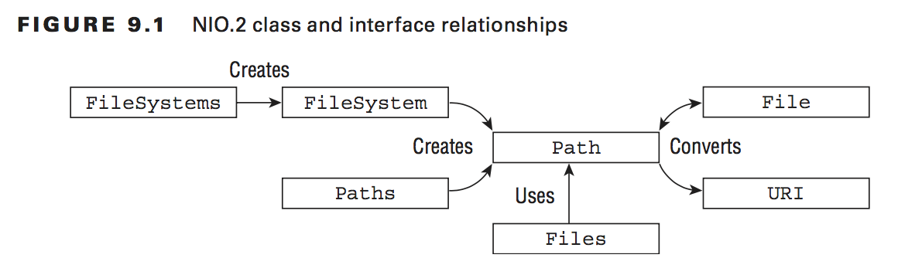
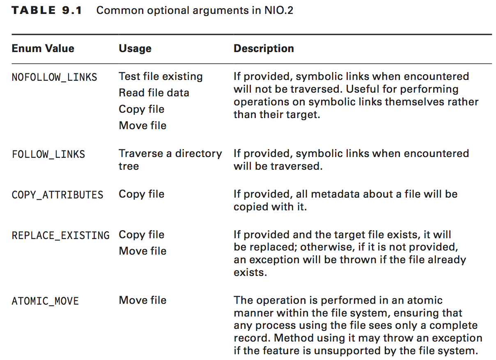
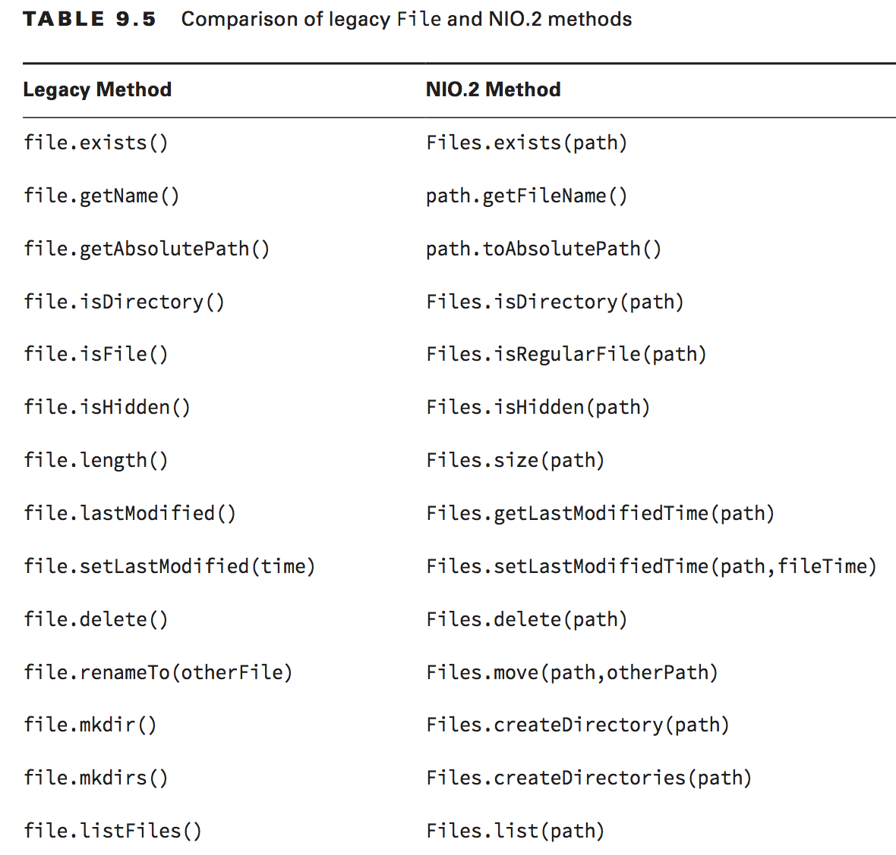

# OCP Chapter 9 - NIO2 (Non Blocking IO)

### Path Interface
- The *java.nio.file.Path* interface is primary entry point for working with nio2 api
- Is a replacement for legacy *java.io.File* class
- In addition to whatever was available via *File* class, Path has these
    - support for symbolic links
- You create an instance of Path using factory method on the **Paths** class

##### Why is Path an interface and not a class?
- So that you wouldn't have to know the underlying filesystem
- The JVM is then able to give you an object to transparently handle system-specific details
- This allows you to write the same code that will work on systems with different filesystems

##### NIO2 class and interface relationship
 </img>

##### Creating Paths
- Use the factory method from **Paths**

```java
// Creates a path using relative directory
Path path1 = Paths.get("pandas/cuddly.png");
// Creates path to absolute file in Windows filesystem
Path path2 = Paths.get("c:\\zooinfo\\November\\employees.txt");
// Create a path to a relative file in a linux system
Path path3 = Paths.get("/home/zoodirector");

// Create path from concatenated strings, split by the System.getProperty("path.separator")
Path path4 = Paths.get("pandas", "cuddly.png");
Path path5 = Paths.get("c:", "zooinfo", "November", "employees.txt");
Path path6 = Paths.get("/", "home", "zoodirector");

// Using a URI (Uniform Resource Identifier)
Path path7 = Paths.get("new URI("file://pandas/cuddly.png")); // throws exception at runtime! (URI must reference absolute paths at runtime)
Path path8 = Paths.get("new URI("file:///c:/zoo-info/November/employees.txt"));
Path path9 = Paths.get("new URI("file:///home/zoodirectory"));
```

#### Is a path absolute or relative?
- If it starts with forward slash, is is an absolute path, such as /bird/parrot
- Starts with drive letter?, is is an absolute path, e.g. C:\bird\emu
- Otherwise it is a relative path, e.g. ..\eagle

#### Accessing the underlying *FileSystem* object
- Path.getPath() is shorthand for java.io.File.FileSystem.getPath()
- To get an instance of the *FileSystem* object, use the FileSystems factory class.

```java
Path path1 = FileSystems.getDefault().getPath("pandas/cuddly.png");
Path path2 = FileSystems.getDefault().getPath("c:", "zooinfo", "November");
Path path3 = FileSystems.getDefauly().getPath("/home/zoodirector");

// FileSystem object gives us ability to connect to remote filesystem
FileSystem fileSystem = FileSystems.getFileSystem( new URI("http://www.selikoff.net"));
Path path = fileSystem.getPath("duck.txt");
```

#### Working with legacy File instances
Converting from *File* to *Path*:
```java
File file = new File("pandas/cuddly.png");
Path path = file.toPath();
```

Converting from *Path* to *File*:
```java
Path path = Paths.get("cuddly.png");
File file = path.toFile();
```

## Interacting with Paths and Files
Path is not a file but a representation of a location within a filesystem. In this way, most operations available in Path and Paths classes can be accomplished whether or not the underlying file that the Path object references actually exists.

A handful of operations do require the file to exist, and that's why path.toRealPath() exists (throws a checked exception if file is not available)

**path.toRealPath()** takes a Path object that may or not point to an existing file within the file system, and returns a reference to a real path within the file system.

### Using Path Objects
| <big>Method</big>      | <big>Notes</big>                                                  |
| ------------------| :----------------------------------------------------------------:|
| path.toString()     | string representation of entire path                               |
| path.getNameCount() | throws **Exception**                        |
| path.getName()      | since Java 7                                |
| path.getFileName()  | |
| path.getParent()    | |
| path.getRoot()      | |
| path.isAbsolute()   | |
| path.toAbsolutePath() | |
| path.subpath()        | |
| path.relativise()     | |
| path.resolve()        | |
| path.normalise()      | |


### Providing Optional Arguments
 </img>

### Difference between File and Path methods
 </img>