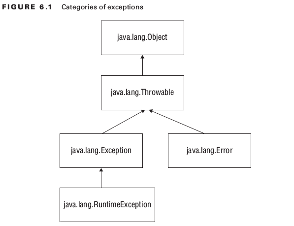

# OCP Chapter 6 - Exceptions and Assertions

 </img>

####Closeable v.s AutoCloseable

| <big>Closeable</big>                   | <big>AutoCloseable</big> |
| -------------                          | :-----------:            |
| throws **IOException**                 | throws **Exception**     |
| prior to Java 7                        | since Java 7             |

#### Traditional try statement
- Uses braces "{}"
- Needs presence of either catch / finally

#### Try with resources
- Uses parenthesis "()"
- Does not require any catch or finally blocks
- Can only be used with classes that implement the *'Closeable'* or *'Autocloseable'*
- Each statement is separated by semi colons ";"

Finally example that rethrows - wipes out evidence of previous exceptions (unfortunate)
Suppressed Exceptions

#### Catch statements
- When catching multiple exceptions, cannot catch broader exception first. E.g. cannot catch Exception first followed by RuntimeException
- Can catch multiple exceptions on a single line in this format:
```java
    try {
      // Some code
    } catch (RuntimeException | FileNotFoundException | ParseException e) {

    }
```
- In a single catch statement
    * Exception e is ONLY allowed to be reassigned to exception of same type or subclass
- In a multi catch statement
    * Exceptions cannot be subclasses of one another
    * Not allowed to re-assign an exception
    ```java
        catch(RuntimeException | ParseException e) {
            e = new AnyException() // Won't compile!
        }
    ```

Example where java converts the exception to the correct type. Quiz 19

#### Assertions

Typically only use assertions for testing and debugging, usually turned off for production

Have to be enabled explicitly when running your java application:
```java
java -ea ClassNameToRun
java -enableassertions ClassNameToRun
java -ea:<package-name>
java -ea:<package-name>... (... means any class is specified package or subclass)

java -da ClassNameToRun
java -disableassertions ClassNameToRun

// (enables all assertions except for on class)
java -ea:com.willey.demos... -da:com.wiley.demos.TestColors my.programs.Main

```

#### Assertion Syntax
assert boolean_expression;
assert boolean_expression: error_message;

It's bad practice to modify outcomes in an assertion, e.g.
```java
// Naughty!, not a good design
assert ++x > 10;
```